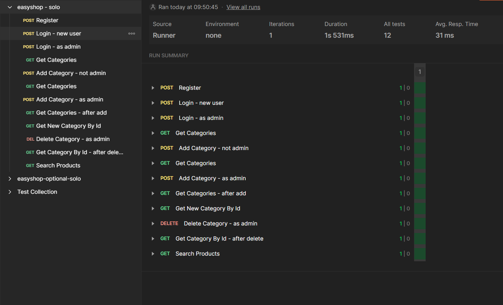

# EasyShop Lite -
## The Product Management System

EasyShop Lite is a simplified Ecommerce webstore designed for easy interaction with a detailed filtration system to ensure you find the product that fits your needs and demands perfectly

---

## Features
- **Friendly UI:** Big Pictures with easy to see prices and filters
- **Easy Search:** User-friendly menus and clear navigation.
- **Organized to a point:** Well-structured logic and connectivity through all ends to ensure seamless functionality.

---

## How it Works
1. **Program Initialization:**
    - The program starts with a home menu, allowing users to filter through products or exit.
2. **Product Filtering:**
    - Users can filter products by category, price range, or color.
    - Filters dynamically display relevant products based on criteria.
   
3. **Viewing Products:**
    - Displays a list of filtered products with details like name, price, description, and image.
   
## Future Features
4. **Shopping Cart Integration:**
5. **Checkout Process:**

- While they can be the buttons can be interacted with, the logic to make it work is not there.
---

## Interesting Code - **Dynamic Filtering**
The **Dynamic Filtering** functionality allows users to narrow down product choices seamlessly by combining multiple criteria like category, price, and color.

### Querying and Testing
In order to ensure accurate filtering and effective integration, a comprehensive test suite has been implemented to verify key functionalities.

#### Test Scenarios
Below is an example of the testing process using automated API calls:  

#### Key Test Scenarios Include:
- **Register New User**
- **Login as User/Admin**
- **Category Management**
- **Search Products**

